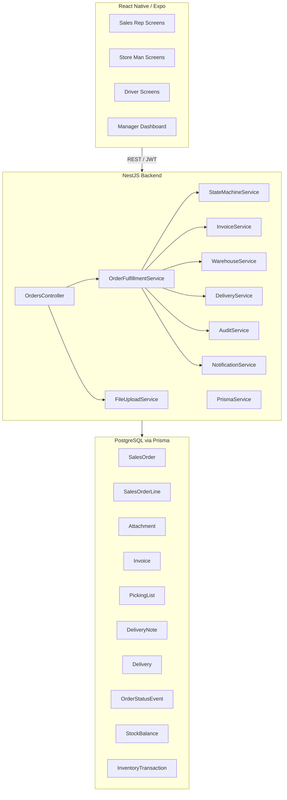
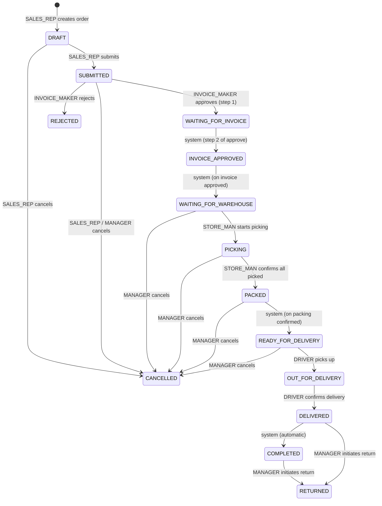
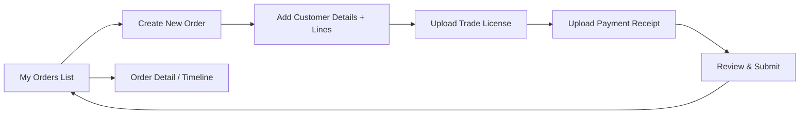
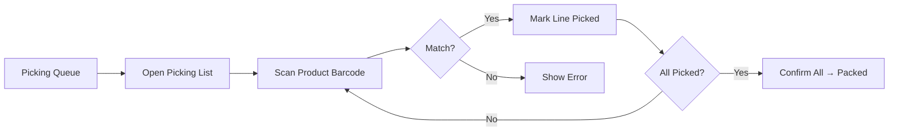
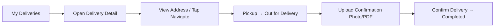

# Design Document — Order Fulfillment Workflow

## Overview

The Order Fulfillment Workflow extends the existing NestJS / React Native platform with a multi-stage order processing pipeline for a pharmacy distributor. It introduces a new `orders` module on the backend and dedicated mobile screens for Sales Representatives, Store Men, and Drivers.

The full lifecycle from order creation to delivery completion is enforced by a server-side state machine. Every transition is gated by role-based access control (RBAC) using the existing `JwtAuthGuard` / `RolesGuard` infrastructure. Five new role values are added to the `Role` enum: `SALES_REP`, `INVOICE_MAKER`, `STORE_MAN`, `DRIVER`, and `MANAGER`.

### Key Design Decisions

- **State machine on the server** — status transitions are validated in the `OrderFulfillmentService` only; no client-supplied status is accepted without guard validation.
- **Separate `SalesOrder` model, not extending `Sale`** — the existing `Sale` model is POS-oriented (instant stock deduction, payment). Sales Orders are pre-fulfillment documents and follow a different lifecycle.
- **File uploads via Multer to local/S3 storage** — consistent with the existing backend pattern; paths stored in the DB.
- **Audit trail as append-only `OrderStatusEvent` table** — immutable audit log that captures every transition.
- **Notifications via in-process event emitter** — NestJS `EventEmitter2` dispatches role-targeted notifications; no external broker required for v1.

---

## Architecture




---

## Components and Interfaces

### Backend Module: `orders`

`src/orders/` follows the same structure as existing modules:

```
src/orders/
  orders.module.ts
  orders.controller.ts          # REST entry points for Sales Order CRUD and transitions
  orders.service.ts             # Orchestrates state machine, invoice, warehouse, delivery
  state-machine.service.ts      # Pure transition guard logic
  invoice.service.ts            # Invoice generation and retrieval
  warehouse.service.ts          # Picking/packing, stock deduction
  delivery.service.ts           # Delivery record management
  audit.service.ts              # Append-only status event recorder
  notification.service.ts       # Role-targeted in-process notifications
  file-upload.service.ts        # Multer wrapper, path storage
  dto/
    create-order.dto.ts
    submit-order.dto.ts
    reject-order.dto.ts
    cancel-order.dto.ts
    confirm-picking.dto.ts
    confirm-delivery.dto.ts
    ...
  types/
    order-status.enum.ts
    transition-event.enum.ts
```

### Role Additions to Prisma Enum

The existing `Role` enum must be extended:

```prisma
enum Role {
  SYSTEM_ADMIN
  OWNER
  MANAGER        // extended: now also gains fulfillment read access
  CASHIER
  STORE_KEEPER
  SALES_REP      // new
  INVOICE_MAKER  // new
  STORE_MAN      // new
  DRIVER         // new
}
```

> `MANAGER` already exists; it gains read access to the fulfillment module. `CASHIER` and `STORE_KEEPER` have no access to fulfillment endpoints.

### NotificationService Interface

```typescript
interface RoleNotification {
  targetRole: Role;
  organizationId: string;
  type: NotificationType;   // ORDER_SUBMITTED | INVOICE_APPROVED | PACKED | READY_FOR_DELIVERY | etc.
  payload: Record<string, unknown>;
}
```

In v1, notifications are stored in a `Notification` table and polled by the mobile app. A push notification layer (FCM) can be added later without changing the interface.

---

## Data Models

### New Prisma Models

```prisma
enum OrderStatus {
  DRAFT
  SUBMITTED
  WAITING_FOR_INVOICE
  INVOICE_APPROVED
  WAITING_FOR_WAREHOUSE
  PICKING
  PACKED
  READY_FOR_DELIVERY
  OUT_FOR_DELIVERY
  DELIVERED
  COMPLETED
  REJECTED
  CANCELLED
  RETURNED
}

model SalesOrder {
  id               String        @id @default(uuid())
  organizationId   String
  organization     Organization  @relation(fields: [organizationId], references: [id])
  branchId         String
  branch           Branch        @relation(fields: [branchId], references: [id])
  salesRepId       String        // User.id with SALES_REP role
  salesRep         User          @relation("SalesRepOrders", fields: [salesRepId], references: [id])
  customerId       String?
  customer         Customer?     @relation(fields: [customerId], references: [id])
  customerName     String
  tin              String        // Tax Identification Number
  deliveryAddress  String
  customerPhone    String?
  status           OrderStatus   @default(DRAFT)
  subtotal         Float         @default(0)
  taxRate          Float         @default(15)
  taxAmount        Float         @default(0)
  grandTotal       Float         @default(0)
  rejectionReason  String?
  cancellationReason String?
  createdAt        DateTime      @default(now())
  updatedAt        DateTime      @updatedAt

  lines            SalesOrderLine[]
  attachments      Attachment[]
  statusEvents     OrderStatusEvent[]
  invoice          Invoice?
  pickingList      PickingList?
  delivery         Delivery?
}

model SalesOrderLine {
  id           String     @id @default(uuid())
  salesOrderId String
  salesOrder   SalesOrder @relation(fields: [salesOrderId], references: [id], onDelete: Cascade)
  productId    String
  product      Product    @relation(fields: [productId], references: [id])
  quantity     Int
  unitPrice    Float
  discount     Float      @default(0)
  total        Float      // (unitPrice * quantity) - discount
}

model Attachment {
  id           String     @id @default(uuid())
  salesOrderId String
  salesOrder   SalesOrder @relation(fields: [salesOrderId], references: [id], onDelete: Cascade)
  type         AttachmentType
  fileName     String
  filePath     String
  mimeType     String
  fileSize     Int        // bytes
  uploadedById String
  uploadedBy   User       @relation(fields: [uploadedById], references: [id])
  createdAt    DateTime   @default(now())
}

enum AttachmentType {
  TRADE_LICENSE
  PAYMENT_RECEIPT
  PURCHASE_ORDER
  OTHER
}

model Invoice {
  id             String     @id @default(uuid())
  salesOrderId   String     @unique
  salesOrder     SalesOrder @relation(fields: [salesOrderId], references: [id])
  organizationId String
  organization   Organization @relation(fields: [organizationId], references: [id])
  invoiceNumber  String     // sequential per org, e.g. "INV-0042"
  invoiceDate    DateTime   @default(now())
  invoiceMakerId String
  invoiceMaker   User       @relation("InvoiceMakerInvoices", fields: [invoiceMakerId], references: [id])
  subtotal       Float
  taxRate        Float
  taxAmount      Float
  grandTotal     Float
  createdAt      DateTime   @default(now())

  lines          InvoiceLine[]
  delivery       Delivery?
}

model InvoiceLine {
  id         String  @id @default(uuid())
  invoiceId  String
  invoice    Invoice @relation(fields: [invoiceId], references: [id], onDelete: Cascade)
  productId  String
  product    Product @relation(fields: [productId], references: [id])
  quantity   Int
  unitPrice  Float
  discount   Float   @default(0)
  total      Float
}
```


```prisma
model PickingList {
  id           String     @id @default(uuid())
  salesOrderId String     @unique
  salesOrder   SalesOrder @relation(fields: [salesOrderId], references: [id])
  createdAt    DateTime   @default(now())
  lines        PickingListLine[]
}

model PickingListLine {
  id            String      @id @default(uuid())
  pickingListId String
  pickingList   PickingList @relation(fields: [pickingListId], references: [id], onDelete: Cascade)
  productId     String
  product       Product     @relation(fields: [productId], references: [id])
  quantity      Int
  picked        Boolean     @default(false)
  binLocation   String?
}

model Delivery {
  id             String       @id @default(uuid())
  salesOrderId   String       @unique
  salesOrder     SalesOrder   @relation(fields: [salesOrderId], references: [id])
  invoiceId      String       @unique
  invoice        Invoice      @relation(fields: [invoiceId], references: [id])
  driverId       String?
  driver         User?        @relation("DriverDeliveries", fields: [driverId], references: [id])
  customerName   String
  deliveryAddress String
  customerPhone  String?
  status         DeliveryStatus @default(PENDING)
  confirmationPath String?    // uploaded delivery confirmation file path
  confirmedAt    DateTime?
  confirmedById  String?
  confirmedBy    User?        @relation("DeliveryConfirmations", fields: [confirmedById], references: [id])
  createdAt      DateTime     @default(now())
  updatedAt      DateTime     @updatedAt
}

enum DeliveryStatus {
  PENDING
  OUT_FOR_DELIVERY
  DELIVERED
}

model OrderStatusEvent {
  id           String      @id @default(uuid())
  salesOrderId String
  salesOrder   SalesOrder  @relation(fields: [salesOrderId], references: [id])
  previousStatus OrderStatus?
  newStatus    OrderStatus
  actorId      String
  actor        User        @relation(fields: [actorId], references: [id])
  note         String?
  createdAt    DateTime    @default(now())
}

model Notification {
  id             String   @id @default(uuid())
  organizationId String
  targetRole     String
  type           String
  payload        Json
  read           Boolean  @default(false)
  createdAt      DateTime @default(now())
}
```

### Invoice Sequence Counter

```prisma
model InvoiceSequence {
  id             String @id @default(uuid())
  organizationId String @unique
  lastNumber     Int    @default(0)
}
```

Incremented atomically inside a transaction when an invoice is created, ensuring sequential numbers scoped to the organization without gaps.

---

## API Endpoint Design

All endpoints are prefixed with `/orders` (or `/invoices`, `/deliveries` as sub-resources). All require `JwtAuthGuard` + `RolesGuard`.

### Sales Orders

| Method | Path | Roles | Description |
|--------|------|-------|-------------|
| `POST` | `/orders` | `SALES_REP` | Create a draft Sales Order |
| `GET` | `/orders` | `SALES_REP`, `INVOICE_MAKER`, `STORE_MAN`, `MANAGER` | List orders (role-filtered) |
| `GET` | `/orders/:id` | `SALES_REP`, `INVOICE_MAKER`, `STORE_MAN`, `MANAGER` | Get order detail |
| `PATCH` | `/orders/:id` | `SALES_REP` | Update a Draft order |
| `POST` | `/orders/:id/submit` | `SALES_REP` | Draft → Submitted |
| `POST` | `/orders/:id/approve` | `INVOICE_MAKER` | Submitted → Waiting for Invoice → Invoice Approved |
| `POST` | `/orders/:id/reject` | `INVOICE_MAKER` | Submitted → Rejected |
| `POST` | `/orders/:id/start-picking` | `STORE_MAN` | Waiting for Warehouse → Picking |
| `POST` | `/orders/:id/confirm-picking` | `STORE_MAN` | Picking → Packed → Ready for Delivery |
| `POST` | `/orders/:id/cancel` | `SALES_REP`, `MANAGER` | → Cancelled (with reason for Manager) |
| `POST` | `/orders/:id/return` | `MANAGER` | Completed/Delivered → Returned |

### Attachments

| Method | Path | Roles | Description |
|--------|------|-------|-------------|
| `POST` | `/orders/:id/attachments` | `SALES_REP` | Upload attachment (multipart/form-data) |
| `GET` | `/orders/:id/attachments/:attachmentId` | All permitted roles | Download attachment |

### Invoices

| Method | Path | Roles | Description |
|--------|------|-------|-------------|
| `GET` | `/invoices/:id` | `INVOICE_MAKER`, `STORE_MAN`, `MANAGER` | Get invoice |
| `GET` | `/invoices/:id/pdf` | `INVOICE_MAKER`, `STORE_MAN`, `MANAGER` | Download invoice PDF |

### Picking Lists

| Method | Path | Roles | Description |
|--------|------|-------|-------------|
| `GET` | `/orders/:id/picking-list` | `STORE_MAN`, `MANAGER` | Get picking list |
| `GET` | `/orders/:id/picking-list/pdf` | `STORE_MAN` | Download picking list PDF |
| `POST` | `/orders/:id/picking-list/scan` | `STORE_MAN` | Confirm a line via barcode scan |
| `GET` | `/orders/:id/delivery-note/pdf` | `STORE_MAN`, `MANAGER` | Download delivery note PDF |

### Deliveries

| Method | Path | Roles | Description |
|--------|------|-------|-------------|
| `GET` | `/deliveries` | `DRIVER`, `MANAGER` | List deliveries (driver-filtered for DRIVER) |
| `GET` | `/deliveries/:id` | `DRIVER`, `MANAGER` | Get delivery detail |
| `POST` | `/deliveries/:id/pickup` | `DRIVER` | Pending → Out for Delivery |
| `POST` | `/deliveries/:id/confirm` | `DRIVER` | Upload confirmation, → Delivered → Completed |

### Dashboard

| Method | Path | Roles | Description |
|--------|------|-------|-------------|
| `GET` | `/orders/dashboard` | All authenticated | Role-scoped metrics object |


---

## State Machine

The `StateMachineService` is a pure function with no side effects. It takes the current status, the requested event, and the acting role, and either returns the new status or throws a `BadRequestException`.

### Status Transition Map



### Allowed Transitions Table

| From | Event | To | Actor |
|------|-------|----|-------|
| `DRAFT` | `submit` | `SUBMITTED` | `SALES_REP` |
| `DRAFT` | `cancel` | `CANCELLED` | `SALES_REP` |
| `SUBMITTED` | `approve` | `WAITING_FOR_INVOICE` → `INVOICE_APPROVED` → `WAITING_FOR_WAREHOUSE` | `INVOICE_MAKER` |
| `SUBMITTED` | `reject` | `REJECTED` | `INVOICE_MAKER` |
| `SUBMITTED` | `cancel` | `CANCELLED` | `SALES_REP`, `MANAGER` |
| `WAITING_FOR_WAREHOUSE` | `start-picking` | `PICKING` | `STORE_MAN` |
| `WAITING_FOR_WAREHOUSE` | `cancel` | `CANCELLED` | `MANAGER` |
| `PICKING` | `confirm-picking` | `PACKED` → `READY_FOR_DELIVERY` | `STORE_MAN` |
| `PICKING` | `cancel` | `CANCELLED` | `MANAGER` |
| `PACKED` | `cancel` | `CANCELLED` | `MANAGER` |
| `READY_FOR_DELIVERY` | `cancel` | `CANCELLED` | `MANAGER` |
| `READY_FOR_DELIVERY` | `pickup` | `OUT_FOR_DELIVERY` | `DRIVER` |
| `OUT_FOR_DELIVERY` | `confirm-delivery` | `DELIVERED` → `COMPLETED` | `DRIVER` |
| `COMPLETED` | `return` | `RETURNED` | `MANAGER` |
| `DELIVERED` | `return` | `RETURNED` | `MANAGER` |

### StateMachineService Implementation Sketch

```typescript
type Transition = {
  allowedRoles: Role[];
  intermediates?: OrderStatus[];
  to: OrderStatus;
};

const TRANSITIONS: Record<OrderStatus, Record<string, Transition>> = {
  DRAFT: {
    submit: { allowedRoles: [Role.SALES_REP], to: OrderStatus.SUBMITTED },
    cancel: { allowedRoles: [Role.SALES_REP], to: OrderStatus.CANCELLED },
  },
  SUBMITTED: {
    approve: {
      allowedRoles: [Role.INVOICE_MAKER],
      intermediates: [OrderStatus.WAITING_FOR_INVOICE, OrderStatus.INVOICE_APPROVED],
      to: OrderStatus.WAITING_FOR_WAREHOUSE,
    },
    reject: { allowedRoles: [Role.INVOICE_MAKER], to: OrderStatus.REJECTED },
    cancel: { allowedRoles: [Role.SALES_REP, Role.MANAGER], to: OrderStatus.CANCELLED },
  },
  // ... (full map as per table above)
};

function transition(currentStatus: OrderStatus, event: string, role: Role): OrderStatus {
  const allowed = TRANSITIONS[currentStatus]?.[event];
  if (!allowed) throw new BadRequestException(`Event '${event}' not valid from status '${currentStatus}'`);
  if (!allowed.allowedRoles.includes(role)) throw new ForbiddenException(`Role '${role}' cannot perform '${event}'`);
  return allowed.to;
}
```

Intermediate statuses (e.g. `WAITING_FOR_INVOICE`, `INVOICE_APPROVED`) during the approval flow are each recorded as `OrderStatusEvent` entries before the order lands in `WAITING_FOR_WAREHOUSE`, maintaining a complete audit trail.

---

## Role-Based Access Control Design

### Role Capability Matrix

| Capability | SALES_REP | INVOICE_MAKER | STORE_MAN | DRIVER | MANAGER |
|-----------|-----------|---------------|-----------|--------|---------|
| Create Sales Order | ✅ own | ❌ | ❌ | ❌ | ❌ |
| Update Draft Order | ✅ own | ❌ | ❌ | ❌ | ❌ |
| Submit Order | ✅ own | ❌ | ❌ | ❌ | ❌ |
| Cancel Order | ✅ (Draft/Submitted own) | ❌ | ❌ | ❌ | ✅ (pre-Out for Delivery) |
| View Submitted Orders | ❌ | ✅ all | ❌ | ❌ | ✅ |
| Approve / Reject Order | ❌ | ✅ | ❌ | ❌ | ❌ |
| View Invoice | ❌ | ✅ | ✅ | ❌ | ✅ |
| View Picking List | ❌ | ❌ | ✅ | ❌ | ✅ |
| Start Picking | ❌ | ❌ | ✅ | ❌ | ❌ |
| Confirm Picking | ❌ | ❌ | ✅ | ❌ | ❌ |
| View Delivery | ❌ | ❌ | ❌ | ✅ own | ✅ |
| Pickup / Confirm Delivery | ❌ | ❌ | ❌ | ✅ own | ❌ |
| Initiate Return | ❌ | ❌ | ❌ | ❌ | ✅ |
| Dashboard | own metrics | own metrics | own metrics | own metrics | all metrics |

### Ownership Scoping

- **SALES_REP**: all queries for `SalesOrder` include `WHERE salesRepId = user.id`.
- **DRIVER**: all queries for `Delivery` include `WHERE driverId = user.id`.
- **INVOICE_MAKER / STORE_MAN / MANAGER**: scoped to `organizationId` only.

A custom `@OrderOwner()` guard decorator checks `salesOrder.salesRepId === request.user.id` for any mutation from `SALES_REP`.


---

## Mobile App Screens and Flows

The mobile app uses Expo Router's file-based routing under `src/app/(app)/`. A new sub-folder `(fulfillment)/` is added, gated by the user's role (checked in `_layout.tsx`).

### Screen Structure

```
src/app/(app)/(fulfillment)/
  _layout.tsx                    # Role-based tab/stack navigator
  # Sales Rep
  orders/
    index.tsx                    # My Orders list (sorted newest first)
    new.tsx                      # Create Order form
    [id].tsx                     # Order detail + status timeline
    [id]/attachments.tsx         # Upload Trade License, Payment Receipt
  # Store Man
  warehouse/
    index.tsx                    # Orders in WAITING_FOR_WAREHOUSE (picking queue)
    [id]/picking.tsx             # Picking list with barcode scan
  # Driver
  deliveries/
    index.tsx                    # My delivery list
    [id].tsx                     # Delivery detail (address, phone, nav link)
    [id]/confirm.tsx             # Upload delivery confirmation
  # Manager / shared
  dashboard.tsx                  # Role-scoped metrics
```

### Sales Rep Flow



### Store Man Flow



### Driver Flow



### Document Upload Component

The mobile app reuses a shared `<DocumentUpload>` component (built with `expo-document-picker` and `expo-image-picker`) that:
1. Lets the user select a file (PDF) or photo (JPG/PNG).
2. Validates the file type and size (`≤ 10 MB`) client-side before uploading.
3. Submits via `multipart/form-data` to `POST /orders/:id/attachments`.
4. Shows upload progress and error states.

---

## File Upload / Storage Design

### Backend: Multer + Local/S3

```typescript
// FileUploadService wraps NestJS Multer
@Injectable()
export class FileUploadService {
  private readonly allowedMimeTypes = ['application/pdf', 'image/jpeg', 'image/png'];
  private readonly maxFileSizeBytes = 10 * 1024 * 1024; // 10 MB

  validateFile(file: Express.Multer.File): void {
    if (!this.allowedMimeTypes.includes(file.mimetype)) {
      throw new BadRequestException(`File type ${file.mimetype} is not allowed`);
    }
    if (file.size > this.maxFileSizeBytes) {
      throw new BadRequestException(`File size exceeds 10 MB limit`);
    }
  }

  async store(file: Express.Multer.File, subPath: string): Promise<string> {
    // v1: store to local disk under uploads/{orgId}/{orderId}/
    // v2: swap to S3 presigned URL upload without changing the interface
    const dest = path.join('uploads', subPath, file.originalname);
    await fs.promises.writeFile(dest, file.buffer);
    return dest; // stored path saved to Attachment.filePath
  }
}
```

### Storage Path Convention

```
uploads/{organizationId}/{salesOrderId}/{attachmentType}_{timestamp}_{filename}
```

### File Download

Attachments are served via `GET /orders/:id/attachments/:attachmentId` which streams the file from disk (or generates a signed S3 URL). Role guards apply — only roles that can view the order can download its attachments.

---

## Notification Design

### In-Process EventEmitter (v1)

`NotificationService` subscribes to NestJS `EventEmitter2` events emitted by `OrderFulfillmentService` after each successful transition.

```typescript
// Events emitted by OrderFulfillmentService:
emitter.emit('order.submitted', { orderId, orgId });
emitter.emit('order.invoice_approved', { orderId, orgId });
emitter.emit('order.ready_for_delivery', { orderId, orgId });

// NotificationService listener:
@OnEvent('order.invoice_approved')
async handleInvoiceApproved(payload) {
  await this.prisma.notification.create({
    data: {
      organizationId: payload.orgId,
      targetRole: 'STORE_MAN',
      type: 'INVOICE_APPROVED',
      payload: payload,
    },
  });
}
```

### Mobile Polling

The mobile app polls `GET /notifications?unread=true` every 30 seconds when the app is in the foreground. Notifications are marked read on open.

### Notification Types

| Event | Target Role | Message |
|-------|-------------|---------|
| `order.submitted` | `INVOICE_MAKER` | "New order submitted for review" |
| `order.invoice_approved` | `STORE_MAN` | "Order ready for warehouse picking" |
| `order.ready_for_delivery` | `DRIVER` | "New delivery assignment available" |
| `order.rejected` | `SALES_REP` | "Your order was rejected: {reason}" |
| `order.cancelled` | `SALES_REP` | "Order has been cancelled" |


---

## Correctness Properties

*A property is a characteristic or behavior that should hold true across all valid executions of a system — essentially, a formal statement about what the system should do. Properties serve as the bridge between human-readable specifications and machine-verifiable correctness guarantees.*

### Redundancy Elimination (Reflection)

Before listing final properties, redundancies identified during prework:
- 1.5 (missing field error) is subsumed by Property 1 (validation covers all required fields).
- 4.5 (Delivery record fields) is subsumed by Property 15 (Delivery record creation covers required fields).
- 9.3 (StockTransaction fields) is subsumed by Property 9 (stock deduction round-trip verifies transaction creation).
- 8.4 (mobile upload validation) is subsumed by Property 4 (attachment validation property).
- 3.6 and 3.7 are combined into Property 10 (Packed → Ready for Delivery + Delivery Note fields).
- 6.1–6.7 are consolidated into Property 12 (Role-permission matrix) and Property 13 (ownership scoping).

---

### Property 1: Sales Order Required Field Validation

*For any* SalesOrder input DTO, the system SHALL reject it with a validation error listing the missing field(s) if any of the following are absent: `customerName`, `tin`, `deliveryAddress`, at least one `SalesOrderLine`, `TRADE_LICENSE` attachment, or `PAYMENT_RECEIPT` attachment.

**Validates: Requirements 1.1, 1.5, 2.6, 2.7**

---

### Property 2: Sales Order Line Total Invariant

*For any* `SalesOrderLine` with `unitPrice ≥ 0`, `quantity > 0`, and `discount ≥ 0`, the computed `total` SHALL equal `(unitPrice × quantity) − discount`.

**Validates: Requirements 1.3**

---

### Property 3: Sales Order Quantity Positivity

*For any* `SalesOrderLine` where `quantity ≤ 0`, the system SHALL reject the order with a validation error for that line.

**Validates: Requirements 1.6**

---

### Property 4: Attachment File Validation

*For any* uploaded file, the system SHALL accept it if and only if its MIME type is one of `{application/pdf, image/jpeg, image/png}` AND its size in bytes is `≤ 10,485,760` (10 MB). Any file failing either condition SHALL be rejected with an error.

**Validates: Requirements 1.8, 8.4**

---

### Property 5: Draft Order Submit Transition

*For any* `SalesOrder` in `DRAFT` status that has all required fields populated, submitting it SHALL transition its status to `SUBMITTED` and create an `OrderStatusEvent` recording `DRAFT → SUBMITTED`.

**Validates: Requirements 1.4, 9.1**

---

### Property 6: Invoice Arithmetic Invariant

*For any* approved `SalesOrder` with `subtotal S` and `taxRate R` (where `0 ≤ R ≤ 100`), the generated `Invoice` SHALL satisfy `taxAmount = S × (R / 100)` and `grandTotal = S + taxAmount`.

**Validates: Requirements 2.2**

---

### Property 7: Invoice Number Sequential Monotonicity

*For any* sequence of invoice generations within the same organization, the assigned invoice numbers SHALL be strictly increasing integers with no gaps (e.g. INV-0001, INV-0002, …).

**Validates: Requirements 2.2**

---

### Property 8: Approval Status Transition Completeness

*For any* `SalesOrder` in `SUBMITTED` status, when the Invoice Maker approves it, the system SHALL record `OrderStatusEvent` entries for each intermediate status (`WAITING_FOR_INVOICE`, `INVOICE_APPROVED`) and the final status SHALL be `WAITING_FOR_WAREHOUSE`.

**Validates: Requirements 2.3, 9.1**

---

### Property 9: Stock Deduction Round-Trip on Packing

*For any* `SalesOrder` in `PICKING` status with N product lines, when packing is confirmed: (a) for each line `i`, `StockBalance[branchId][productId_i]` after packing SHALL equal `StockBalance[branchId][productId_i]` before packing minus `quantity_i`; and (b) exactly N `InventoryTransaction` records of type `OUT` referencing the `SalesOrder.id` SHALL be created.

**Validates: Requirements 3.3, 3.4, 9.3**

---

### Property 10: Insufficient Stock Blocks Packing

*For any* `SalesOrder` in `PICKING` status where at least one `SalesOrderLine` has a `quantity` exceeding the current `StockBalance` for that product at the branch, the system SHALL reject `confirm-picking` and return an error listing each affected product and its available quantity. The `StockBalance` SHALL remain unchanged.

**Validates: Requirements 3.5**

---

### Property 11: Barcode Scan Picking Confirmation

*For any* `PickingList` and any scanned barcode value: if the barcode matches a product on an unpicked line in the list, that line SHALL be marked `picked = true`; if the barcode matches no line in the list, the system SHALL return an error and the picking list SHALL remain unchanged.

**Validates: Requirements 3.10**

---

### Property 12: Delivery Record Field Completeness

*For any* `SalesOrder` that transitions to `READY_FOR_DELIVERY`, the system SHALL create a `Delivery` record containing non-null values for: `salesOrderId`, `invoiceId`, `customerName`, `deliveryAddress`, and `customerPhone` (where present in the order).

**Validates: Requirements 4.1, 4.5**

---

### Property 13: Delivery Confirmation Requires Upload

*For any* `confirm-delivery` request that does not include a file upload, the system SHALL return a validation error and the `Delivery` status SHALL remain unchanged.

**Validates: Requirements 4.8**

---

### Property 14: Driver Delivery Ownership Filtering

*For any* Driver user D and any set of `Delivery` records assigned to multiple drivers, `GET /deliveries` SHALL return only records where `driverId = D.id`.

**Validates: Requirements 4.6, 4.9**

---

### Property 15: Stock Reversal on Cancellation

*For any* `SalesOrder` cancelled in `PICKING`, `PACKED`, or `READY_FOR_DELIVERY` status, where stock was previously deducted: for each product line `i`, `StockBalance[branchId][productId_i]` after cancellation SHALL equal the value before picking began, and a compensating `InventoryTransaction` of type `IN` referencing the `SalesOrder.id` SHALL exist for each line.

**Validates: Requirements 5.3, 9.3**

---

### Property 16: Return Stock Compensation

*For any* `SalesOrder` in `COMPLETED` or `DELIVERED` status for which a return is initiated: for each returned product line `i`, an `InventoryTransaction` of type `IN` with `quantity = returned_quantity_i` referencing the `SalesOrder.id` SHALL be created.

**Validates: Requirements 5.4**

---

### Property 17: Historical Record Preservation

*For any* `SalesOrder` that is cancelled or returned, all associated records (`SalesOrder`, `Invoice`, `Delivery`, `OrderStatusEvent`, `InventoryTransaction`) SHALL remain present in the database with their original field values unchanged.

**Validates: Requirements 5.5, 9.5**

---

### Property 18: Role-Permission Matrix Enforcement

*For any* user with role R attempting to access endpoint E where R is not in E's permitted roles list, the system SHALL return HTTP 403 Forbidden. This holds for all (role, endpoint) pairs in the capability matrix defined in the RBAC Design section.

**Validates: Requirements 6.1, 6.2, 6.3, 6.4, 6.5, 6.6**

---

### Property 19: Sales Rep Order Ownership Scoping

*For any* two distinct `SALES_REP` users A and B, user A attempting to read or mutate an order owned by user B SHALL receive HTTP 403 Forbidden.

**Validates: Requirements 1.7, 6.7**

---

### Property 20: Dashboard Metric Count Accuracy

*For any* organization with a set of `SalesOrder` and `Delivery` records in various statuses, the dashboard metric for each status category SHALL equal the exact count of records in that status at the time of the request.

**Validates: Requirements 7.1, 7.2, 7.3, 7.4, 7.5**

---

### Property 21: Audit Event Completeness

*For any* status transition performed by any authenticated actor, exactly one `OrderStatusEvent` record SHALL be created capturing: the correct `previousStatus`, `newStatus`, `actorId` (the requesting user's ID), and a `createdAt` timestamp within the transaction.

**Validates: Requirements 9.1, 9.2, 9.4**

---

### Property 22: Orders List Sort Order

*For any* `SALES_REP` user with a set of their own orders, `GET /orders` SHALL return all orders sorted by `createdAt` descending (newest first).

**Validates: Requirements 1.10**

---

### Property 23: Rejection Reason Minimum Length

*For any* rejection attempt by an Invoice Maker, the system SHALL reject the action if the provided reason has fewer than 10 characters, and SHALL accept it (transitioning to `REJECTED`) if the reason has 10 or more characters.

**Validates: Requirements 2.5**

---

### Property 24: Manager Cancellation Reason Minimum Length

*For any* cancellation attempt by a Manager, the system SHALL reject the action if the provided reason has fewer than 10 characters, and SHALL accept it (transitioning to `CANCELLED`) if the reason has 10 or more characters.

**Validates: Requirements 5.2**


---

## Error Handling

### Validation Errors (400 Bad Request)

All DTOs use `class-validator` decorators consistent with existing modules. The global `AllExceptionsFilter` (`src/common/all-exceptions.filter.ts`) already handles formatting. Custom error shapes:

```json
{
  "statusCode": 400,
  "message": ["customerName must not be empty", "tin must not be empty"],
  "error": "Bad Request"
}
```

For domain errors (e.g. insufficient stock), a structured body is returned:

```json
{
  "statusCode": 400,
  "error": "INSUFFICIENT_STOCK",
  "details": [
    { "productId": "abc", "productName": "Amoxicillin 500mg", "available": 5, "requested": 20 }
  ]
}
```

### State Machine Violations (400 Bad Request)

Attempting an invalid transition returns:

```json
{
  "statusCode": 400,
  "error": "INVALID_TRANSITION",
  "message": "Cannot apply event 'approve' to order in status 'DRAFT'"
}
```

### Permission Errors (403 Forbidden)

Returned by `RolesGuard` or the order ownership guard:

```json
{
  "statusCode": 403,
  "message": "Forbidden resource"
}
```

### Not Found (404)

```json
{
  "statusCode": 404,
  "message": "SalesOrder not found"
}
```

### File Upload Errors (400)

```json
{
  "statusCode": 400,
  "error": "INVALID_FILE",
  "message": "File type image/gif is not allowed. Accepted: pdf, jpg, jpeg, png"
}
```

### Transactional Integrity

All operations that mutate multiple tables (stock deduction, invoice creation with sequence, status event creation) run inside `prisma.$transaction(...)`, consistent with the existing `SalesService` and `InventoryService` patterns. On any error within the transaction, all changes are rolled back automatically.

---

## Testing Strategy

### Test Framework

The existing project uses Jest (configured in `backend/package.json`). Property-based testing uses **[fast-check](https://github.com/dubzzz/fast-check)** — the most mature TypeScript-native PBT library, with no additional runtime dependencies.

Install: `npm install --save-dev fast-check`

### Dual Testing Approach

**Unit / Example Tests** (`*.spec.ts` co-located with source):
- Specific happy-path and error-path scenarios with concrete inputs.
- Integration points between services (mock `PrismaService`).
- State machine transition table (one test per row in the allowed transitions table).
- Invoice Maker cannot modify line items (single example).
- Token expiry redirects to login (single example).

**Property-Based Tests** (`*.pbt.spec.ts` co-located):
- Implement each correctness property listed above.
- Minimum 100 iterations per property (fast-check default is 100; set `{ numRuns: 100 }` explicitly).
- Each test is tagged with a comment referencing the design property.

### Property Test Configuration

```typescript
// Tag format in test files:
// Feature: order-fulfillment-workflow, Property 2: Sales Order Line Total Invariant
import fc from 'fast-check';

it('line total = (unitPrice * quantity) - discount for any valid inputs', () => {
  // Feature: order-fulfillment-workflow, Property 2: Sales Order Line Total Invariant
  fc.assert(
    fc.property(
      fc.float({ min: 0, noNaN: true }),           // unitPrice
      fc.integer({ min: 1, max: 10_000 }),          // quantity
      fc.float({ min: 0, noNaN: true }),            // discount
      (unitPrice, quantity, discount) => {
        const total = computeLineTotal(unitPrice, quantity, discount);
        expect(total).toBeCloseTo(unitPrice * quantity - discount);
      }
    ),
    { numRuns: 100 }
  );
});
```

### Test Coverage Areas

| Area | Test Type | Properties Covered |
|------|-----------|-------------------|
| DTO validation | PBT | 1, 3, 4, 23, 24 |
| Line total arithmetic | PBT | 2 |
| State machine transitions | Unit + PBT | 5, 8 |
| Invoice arithmetic | PBT | 6 |
| Invoice sequence | PBT | 7 |
| Stock deduction round-trip | PBT | 9, 10 |
| Barcode scan matching | PBT | 11 |
| Delivery record creation | PBT | 12, 13 |
| Driver delivery scoping | PBT | 14 |
| Stock reversal (cancel/return) | PBT | 15, 16 |
| Record preservation | PBT | 17 |
| RBAC matrix | PBT | 18, 19 |
| Dashboard metrics | PBT | 20 |
| Audit event creation | PBT | 21 |
| Orders list sort order | PBT | 22 |
| PDF generation | Integration (1-2 examples) | — |
| Mobile screen rendering | Smoke (manual/Detox) | — |

### Integration Tests

- PDF generation endpoints: verify `Content-Type: application/pdf` and non-empty body.
- Full workflow E2E via `test/jest-e2e.json` (existing setup): create order → submit → approve → pick → pack → deliver → confirm.
- These run against a test PostgreSQL database seeded by the existing `prisma/seed.ts` pattern.

### Running Tests

```bash
# Unit + PBT tests
cd backend && npx jest --testPathPattern="orders" --runInBand

# E2E tests
cd backend && npx jest --config test/jest-e2e.json --runInBand
```

> Do not use `--watch` mode in CI; use `--runInBand` for deterministic PBT seed replay.
